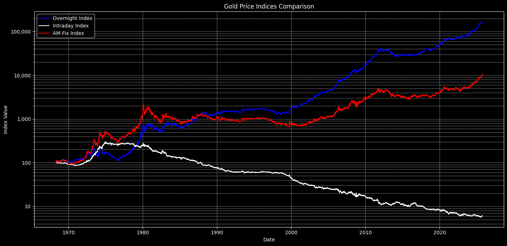
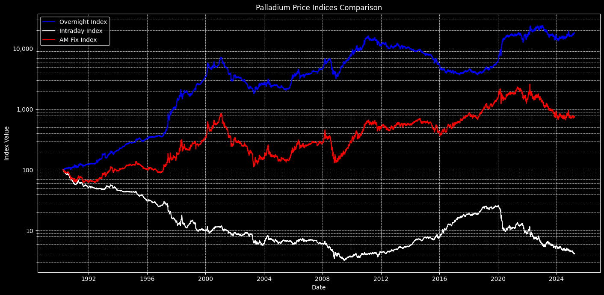
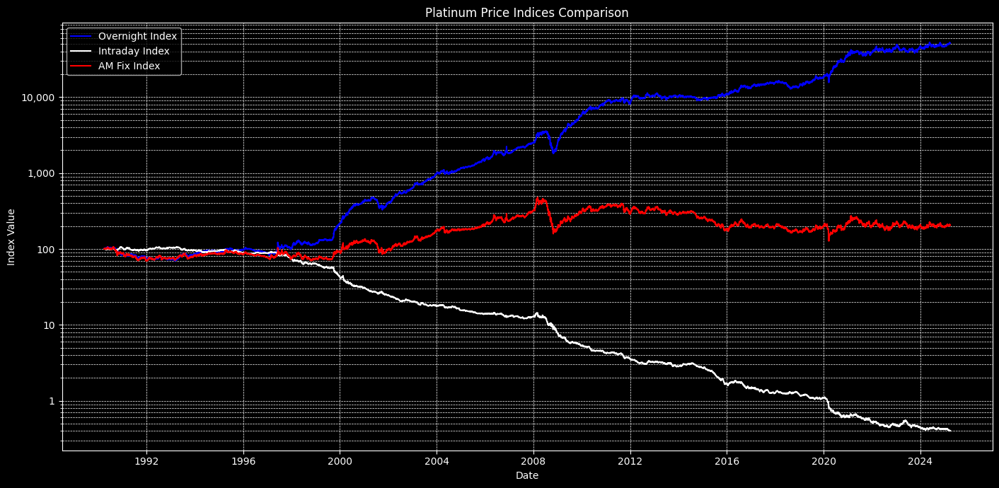

# Analysis of LBMA Precious Metal Price Indices

## Overview

This repository contains a Python-based analysis of the London Bullion Market Association (LBMA) AM and PM fixing prices for gold, platinum, and palladium. The analysis reveals a significant and persistent anomaly in the price behavior of these metals. The core finding is that nearly all of the long-term price appreciation for gold and platinum has occurred during overnight hours (approximating Asian and early European trading sessions), while intraday hours (approximating European and US trading sessions) have shown substantial losses over decades.

Three indices are calculated from the daily AM and PM fix prices to illustrate this pattern:
1.  **Overnight Index**: Measures the cumulative return from buying at the PM fix and selling at the next day's AM fix.
2.  **Intraday Index**: Measures the cumulative return from buying at the AM fix and selling at the PM fix on the same day.
3.  **AM Fix Index**: A simple buy-and-hold benchmark based on the AM fix price.

---

## Key Findings

### Gold (Data from 1968)

The analysis of gold prices shows a stark divergence in performance between trading sessions.

*   **Overnight Index**: Grew to **171,305.59** with a CAGR of **13.83%**.
*   **Intraday Index**: Declined to **6.12**, representing a near-total loss of initial capital, with a CAGR of **-4.73%**.
*   **AM Fix Index (Buy and Hold)**: Grew to **10,483.91** with a CAGR of **8.43%**.

| Metric                  | Overnight Index | Intraday Index | AM Fix Index |
| ----------------------- | --------------- | -------------- | ------------ |
| Final Index Value       | 171,305.59      | 6.12           | 10,483.91    |
| CAGR                    | 13.83%          | -4.73%         | 8.43%        |
| Annualized Volatility   | 15.88%          | 9.97%          | 19.52%       |

### Palladium (Data from 1990)

Palladium shows a similar, though less extreme, pattern compared to gold and platinum.

*   **Overnight Index**: Grew to **22,150.92** with a CAGR of **16.41%**.
*   **Intraday Index**: Declined to **4.55** with a CAGR of **-8.34%**.
*   **AM Fix Index (Buy and Hold)**: Grew to **990.26** with a CAGR of **6.67%**.

| Metric                  | Overnight Index | Intraday Index | AM Fix Index |
| ----------------------- | --------------- | -------------- | ------------ |
| Final Index Value       | 22,150.92       | 4.55           | 990.26       |
| CAGR                    | 16.41%          | -8.34%         | 6.67%        |
| Annualized Volatility   | 26.87%          | 18.14%         | 33.21%       |

### Platinum (Data from 1990)

Platinum exhibits the most extreme divergence, with the intraday strategy leading to near-complete capital destruction.

*   **Overnight Index**: Grew to **84,393.88** with a CAGR of **20.86%**.
*   **Intraday Index**: Declined to just **0.41**, wiping out nearly all initial capital, with a CAGR of **-14.36%**.
*   **AM Fix Index (Buy and Hold)**: Grew to **338.80** with a CAGR of **3.50%**.

| Metric                  | Overnight Index | Intraday Index | AM Fix Index |
| ----------------------- | --------------- | -------------- | ------------ |
| Final Index Value       | 84,393.88       | 0.41           | 338.80       |
| CAGR                    | 20.86%          | -14.36%        | 3.50%        |
| Annualized Volatility   | 19.50%          | 10.90%         | 22.76%       |

---

## Code and Usage

### Requirements
- pandas
- numpy
- matplotlib
- requests

### Running the Analysis
The analysis is performed using the 'lbma divergence.ipynb' Jupyter notebook.